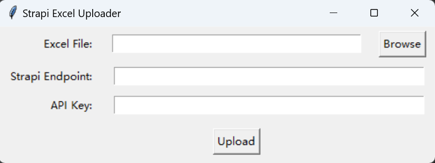

# Strapi Excel Bulk Uploader

## Overview

The **Strapi Excel Uploader** is a Python program that simplifies the process of uploading data from an Excel file to a Strapi collection type. It allows you to provide an Excel file, specify the Strapi API endpoint, and authenticate using an API key. The program processes the Excel data, wraps it in the required JSON structure, and uploads it to Strapi.

---

## Features
1. **User-Friendly GUI**:
   - Select an Excel file via a file browser.
   - Enter the Strapi API endpoint and API key.

2. **Data Processing**:
   - Reads Excel data and handles each row as a JSON object.
   - Converts all fields to strings for consistency.

3. **Error Handling**:
   - Skips rows with empty values in the first column.
   - Displays success or error messages for each row upload.

4. **Strapi Integration**:
   - Wraps payload in the `{ data: { ... } }` format required by Strapi.

---

## Installation

1. Clone this repository:
   ```bash
   git clone https://github.com/your-repo/strapi-excel-uploader.git
   cd strapi-excel-uploader
   ```

2. Install dependencies:
   ```bash
   pip install pandas requests openpyxl
   ```

3. Run the program:
   ```bash
   python bulk_upload.py
   ```

---

## Usage



1. **Select an Excel File**:
   - Click the "Browse" button and choose an Excel file (`.xlsx` or `.xls`).

2. **Enter Strapi Details**:
   - **Strapi Endpoint**: Enter the API endpoint of the Strapi collection type. (Or any API system that accept data creation exactly like Strapi)
   - **API Key**: Enter your Strapi API key (obtained from the Strapi admin panel).

3. **Upload Data**:
   - Click "Upload" to process the data and upload it to Strapi.

---

## Data Cleaning Basics 
Before using the program, ensure your Excel data is clean and properly formatted (Col Name - Field Name). Here are some basic data cleaning concepts:

### 1. **Remove Empty Rows**
   - Delete rows where key fields are empty (e.g., ID, Name).
   - The program automatically skips rows where the first column is empty.

### 2. **Check and Fix Invalid Data**
   - Ensure all fields meet the expected format or constraints.
   - Example: Dates should be in a consistent format (e.g., `YYYY-MM-DD`).

### 3. **Standardize Data**
   - Convert all text to lowercase/uppercase if needed for consistency.
   - Remove leading/trailing spaces in text fields.

### 4. **Handle Missing Values**
   - Decide how to treat missing values:
     - Replace with a default value (e.g., `N/A`).
     - Leave as `None` (program treats `None` as `null` in JSON).

### 5. **Validate Unique Identifiers**
   - Ensure no duplicate values in unique identifier fields like IDs or emails.

### 6. **Data Type Consistency**
   - Convert numeric fields to numbers, text fields to strings, and date fields to a unified format.

---

## Example Workflow

1. **Excel Data (Before Cleaning)**:
   | ID   | Name       | Date       | Email             |
   |------|------------|------------|-------------------|
   | 1    | Alice      | 2024-12-06 | alice@example.com |
   |      | _        | 12-2024-07 | somebd@xxx.com   |
   | 3    | Bob    | Invalid    | bob@          |

2. **Excel Data (After Cleaning)**:
   | ID   | Name       | Date       | Email             |
   |------|------------|------------|-------------------|
   | 1    | Alice      | 2024-12-06 | alice@example.com |
   | 3    | Bob    | 2024-12-08 | charlie@example.com |

---

## Troubleshooting

- **Empty Rows Not Uploaded**: Ensure the first column has valid values, emptying first row could be used for marking uploaded data lines.
- **Invalid API Key**: Double-check the Strapi API key.
- **Invalid Endpoint**: Verify the endpoint URL matches your Strapi collection type.

---

> Written by Hanny, Last Update 06-12-2024
